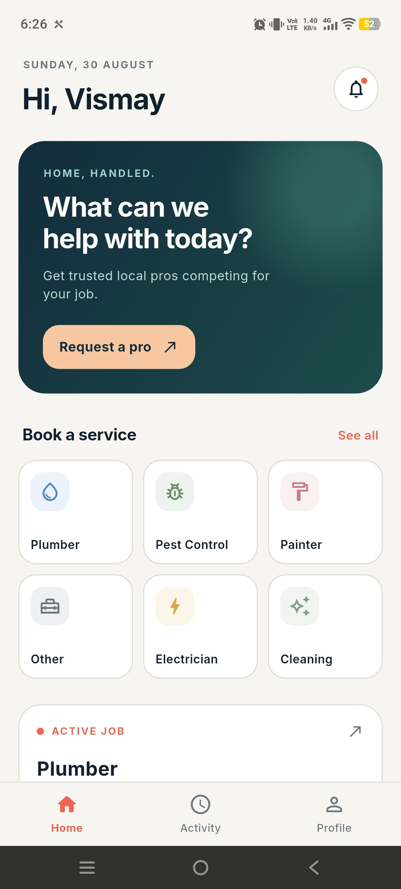
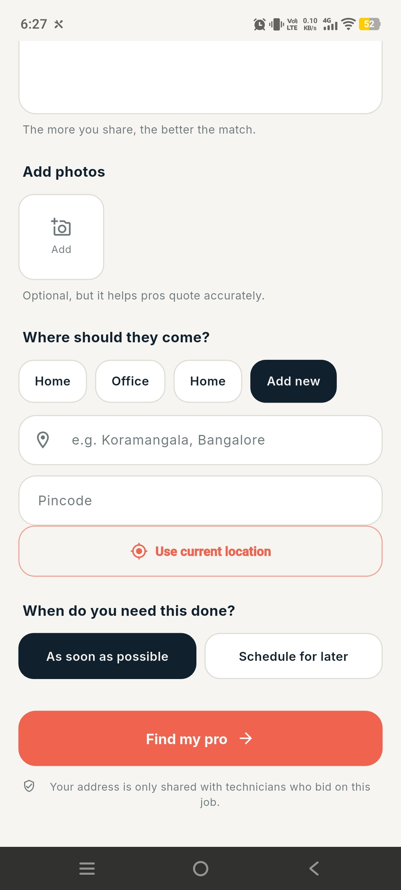
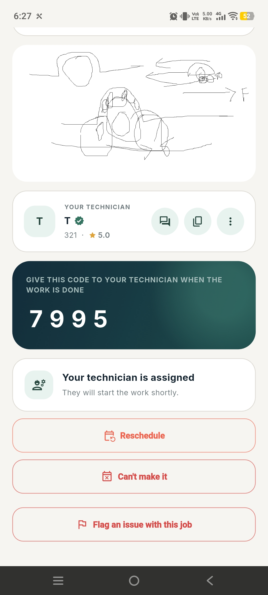
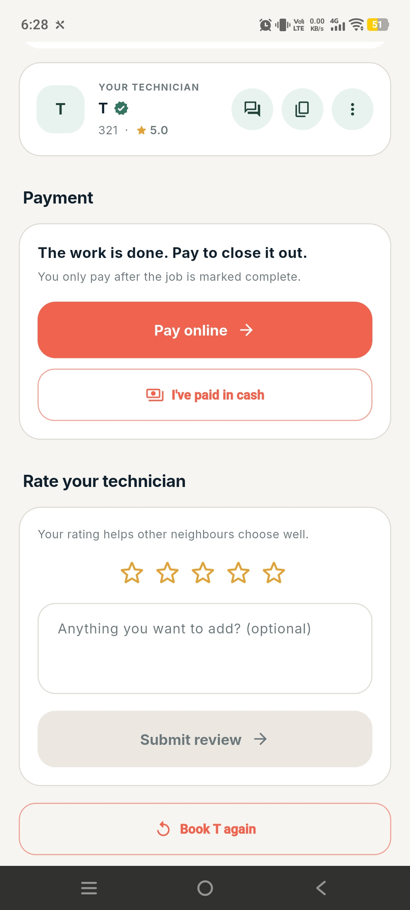
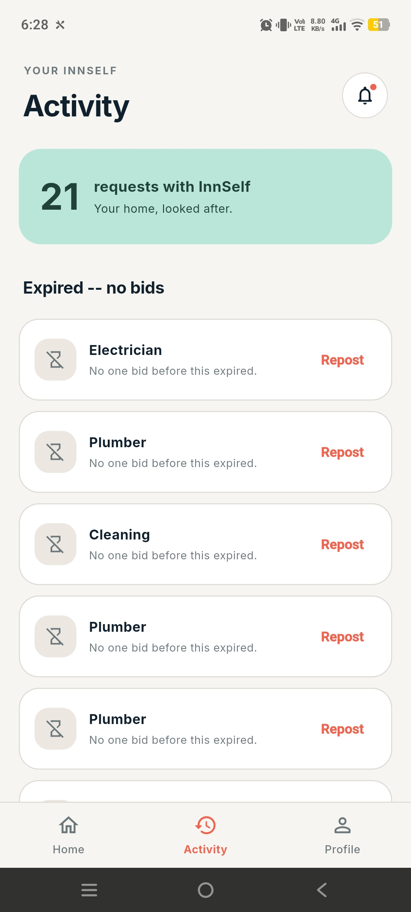
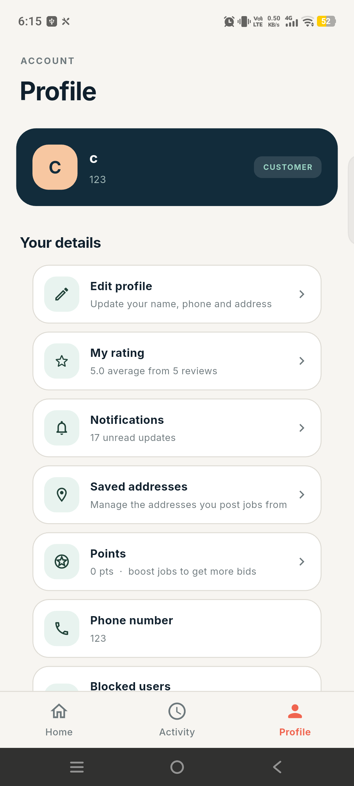

# InnSelf

<div align="center">
  

  <p>
    <strong>A two-sided marketplace Android app connecting customers with local technicians.</strong><br />
    Post a job, get bids from real people nearby, track it to completion, pay, and review — all in one app.
  </p>

  <p>
    
    
    
    
    
  </p>
</div>

---

## What is this?

Think Urban Company, but built from the ground up as a real full-stack
project: **customers** post a household job — a leaking tap, a fan that
won't stop rattling, a fridge on the fritz — and nearby **technicians**
bid on it. The customer picks a bid, watches the job move through a
live status timeline, pays when it's done, and rates the technician.
Technicians build a track record, get verified, and earn reward points
for reliable work.

It's a genuinely complete marketplace: real-time chat, push
notifications, GPS-based matching, in-app disputes and admin tools,
light/dark mode, and a KYC-backed trust system — not a demo with a
happy path and nothing else.

## Screenshots

<table>
  <tr>
    <td></td>
    <td></td>
    <td></td>
  </tr>
  <tr>
    <td align="center"><sub>Home — request a pro,<br />track an active job</sub></td>
    <td align="center"><sub>Posting a job with<br />photos and location</sub></td>
    <td align="center"><sub>Live status, verified<br />technician, completion code</sub></td>
  </tr>
  <tr>
    <td></td>
    <td></td>
    <td></td>
  </tr>
  <tr>
    <td align="center"><sub>Pay online or in cash,<br />then rate the technician</sub></td>
    <td align="center"><sub>Request history, with<br />one-tap repost on expiry</sub></td>
    <td align="center"><sub>Account, points,<br />saved addresses</sub></td>
  </tr>
</table>

## Features

### For customers
- Post a job with photos, a structured category (with a second-step
  picker for things like *Appliance Repair → Fridge Repair*), and a
  location — pick a saved address or use your current GPS location,
  reverse-geocoded into a real address automatically
- Compare bids, see a technician's rating and verified badge, and see
  price guidance drawn from real historical accepted bids in that
  category before you pick
- Watch the job move through a live status timeline: technician
  assigned → on the way (with an ETA) → in progress → completed
- A 4-digit code the technician needs from you before they can mark
  the job done — no silently-marked-complete jobs
- Pay online through Razorpay, or mark it paid in cash
- Rate and review the technician, then rebook them directly next time
- Reschedule or cancel after a technician is assigned, with a reason
- A job with no bids auto-expires after 3 days and can be reposted in
  one tap
- Earn reward points for on-time payment and leaving reviews; spend
  them to boost a job's visibility to technicians
- Tap-to-call, WhatsApp, or open Google Maps directions straight to
  the technician, or chat with them in-app
- Report or block a technician if something goes wrong

### For technicians
- KYC verification (PAN / Voter ID / Driving Licence), reviewed by an
  admin, with a customer-facing verified badge once approved
- Structured skill categories plus a real service radius — matching is
  done by actual GPS distance, not a free-text "area" field
- An availability toggle that controls whether you show up in new-job
  alerts at all
- A job feed that defaults to your skills, or browse everything, live
  and sorted by distance
- Bid on open jobs, withdraw a bid while it's still pending, or get a
  direct invite-only request from a returning customer
- A wallet screen showing total earnings and the full paid-job history
- The same reward points system, earned the same way

### Platform-wide
- **Real-time chat** between customer and technician once a bid is
  accepted, plus a separate **support chat with admins** for account
  issues — not email tickets
- **Push notifications** (Firebase Cloud Messaging) for every event
  that matters — new bid, bid accepted, technician on the way, job
  completed, payment received, new message, job expiring or cancelled,
  and more — plus an in-app notification bell and list
- **Full light and dark mode**, following your phone's system setting
  or overridden manually, remembered across app restarts
- **Dispute flagging**, with an admin console to review and resolve
- **Admin surface**: approve/reject KYC submissions, resolve disputes,
  review user reports, and answer support chats
- Location permission is explained *before* the OS prompt fires
  (required for Play Store compliance), and a denied-forever state
  routes you straight to Settings instead of nagging
- Account deletion that hard-deletes a clean account or anonymises one
  with job history, rather than silently keeping everything forever

## Tech stack

| Piece | Choice |
| --- | --- |
| App | Flutter, Android only (there is no `ios/` directory) |
| Backend | Supabase — Postgres + Row Level Security + Edge Functions + Storage |
| Auth | Email/password only |
| Payments | Razorpay (online) plus a cash-settlement path |
| Push | Firebase Cloud Messaging via a `pg_net` trigger |
| Maps | Google Maps universal links for turn-by-turn directions |

## Project layout

```
lib/
  core/       theme (light/dark), formatting, shared widgets, location
  models/     plain data classes shared across features
  features/
    auth/         email/password sign-in, password reset
    profile/      customer & technician profiles, KYC, edit
    jobs/          post, feed, bidding, job detail, categories
    bids/          bid submission and withdrawal
    payments/      Razorpay + cash, technician wallet
    reviews/       two-way ratings
    messages/      real-time chat between customer and technician
    notifications/  in-app + push notification handling
    points/        reward points, earning and spending
    disputes/       flagging and tracking
    safety/         report & block
    support/        in-app support chat with admins
    admin/          KYC review, disputes, reports, support console
    shell/          bottom-nav tab shells for each role
supabase/
  migrations/   every schema change, run in order, several as templates
  functions/    Edge Functions (see below)
docs/           privacy policy, terms, account deletion page (GitHub Pages)
```

## Getting set up

The repo deliberately carries no credentials. Four things have to be
supplied locally before it will build and run:

1. **Supabase keys** — copy `lib/core/env.example.dart` to
   `lib/core/env.dart` and fill in your project URL and publishable key.
2. **Firebase** — create a Firebase project, register an Android app
   with package `com.innself.app`, and drop `google-services.json` into
   `android/app/`. The Google services Gradle plugin is applied
   unconditionally, so the build fails without it.
3. **Release signing** *(only for release builds)* — `android/key.properties`
   plus the keystore it points at. Absent, the build falls back to debug
   signing.
4. **Migrations** — run everything in `supabase/migrations/` in order,
   in the Supabase SQL Editor. Several are templates: read the header
   comment before running. `011_send_push_trigger.sql` in particular has
   placeholders that must be substituted first, and will refuse to run
   otherwise.

Then:

```bash
flutter pub get
flutter run
```

## Edge Functions

Deployed separately with the Supabase CLI (`npx supabase functions deploy <name>`):

| Function | Purpose | JWT verification |
| --- | --- | --- |
| `create-razorpay-order` | Creates an order for the app to pay against | On |
| `razorpay-webhook` | Razorpay calls this to confirm capture — the only place a payment is marked paid | **Off** (external caller) |
| `delete-account` | Hard-deletes a clean account, anonymises one with history | On |
| `send-push` | Sends FCM push for a new notification row | On |

`send-push` needs an `FCM_SERVICE_ACCOUNT_JSON` secret — the JSON key of
a Firebase service account with the Cloud Messaging Admin role.

## Admin access

There is no in-app path to becoming an admin, by design. Grant it
directly:

```sql
insert into admins (user_id) values ('<profile-uuid>');
```

An "Admin" row then appears in that account's profile tab.

## Conventions

- **Migrations are idempotent.** `create table if not exists`,
  `drop policy if exists` before `create policy`, `do $$ ... end $$`
  guards around constraint and publication changes. A partial run must
  be safe to re-run.
- **Never put a cross-table `EXISTS` in an RLS policy on `jobs` or
  `bids`.** That caused infinite recursion (error 42P17) once already.
  Use a `SECURITY DEFINER ... STABLE` helper returning a narrow
  boolean or uuid instead — several already exist.
- **Clients never insert into `notifications`.** Only `SECURITY DEFINER`
  trigger functions do, so a notification always reflects something that
  actually happened. `job_cancellations` follows the same rule.
- **Theme colors are getters, not constants.** `AppColors`/`AppText`
  read the active theme at call time to support live light/dark
  switching — never wrap a widget that uses them in `const`, or it will
  silently stop repainting when the theme changes.
- **Layout:** `lib/features/<feature>/` with `<feature>_repository.dart`
  for data access, `screens/` for pages, `widgets/` for pieces;
  `lib/models/` for plain data classes; `lib/core/` for theme,
  formatting and shared widgets.

## Status

Functionally complete and actively maintained — every feature above is
built and working, not a mockup. Not yet on the Play Store: the app
still needs a lawyer's review of the privacy policy and terms
(AI-drafted, and this app handles payments, KYC documents, and puts
strangers in each other's homes — that's worth getting right) and the
usual store-listing steps on Google's side.

## License

No license file yet — treat this as "all rights reserved" for now
unless the repo owner says otherwise.
